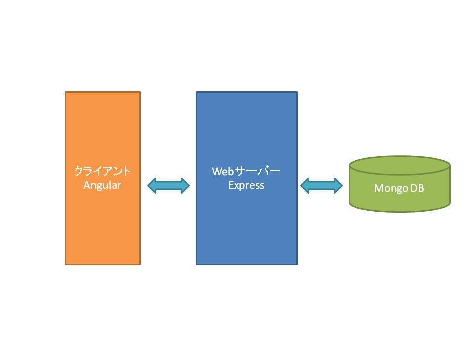
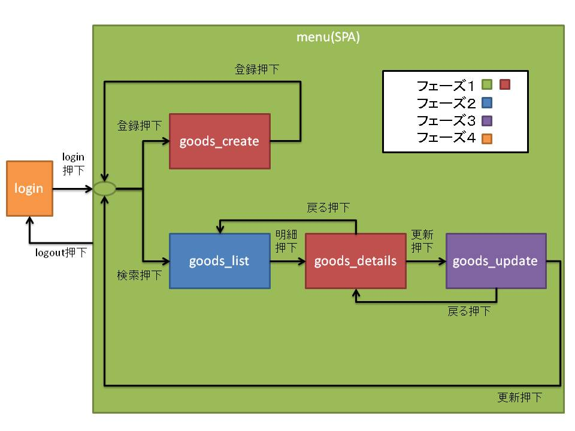

# open-sample

オープン系システム開発の基礎部分に触れるためのサンプル

## Overview



シンプルな商品管理システムを構築する  
大まかな構成は以下の通り

- 必須機能は商品の登録、更新、参照、検索
- 言語は`nodejs`で作成する
- 画面は`SPA`で作成する
- 画面系のフレームワークには`Angular`を使用する
- Webサーバーのフレームワークには`Express`を使用する
- DatabaseにはNoSQLの`MongoDB`を使用する

__NOTE__  
[SPA](https://digitalidentity.co.jp/blog/creative/about-single-page-application.html)とは  
[NoSQL、MongoDB](https://qiita.com/Brutus/items/8a67a4db0fdc5a33d549)とは

## Preparation

### Instrall

以下をインストールする

- vscode
  - コードエディタ、日本語化もできる
  - https://code.visualstudio.com/
- nvm,node,npm
  - nodeはv10.13.0をインストールする
  - https://qiita.com/idani/items/53567d92f936846e111c
- git
  - https://git-scm.com/
- MongoDB
  - https://it-blue-collar-dairy.com/mongodb-install/

__NOTE__  
[git](https://qiita.com/gold-kou/items/7f6a3b46e2781b0dd4a0)とは  

### Training

nodejsやMongoDBに慣れるために、以下のリンク先の入門を実施する

[node.js 超入門①node.jsでwebサーバを作ってみる](https://qiita.com/ritukiii/items/7f28554369d63eb373c3)  
[node.js 超入門②webサーバを作る(ルーティングもやってみる)](https://qiita.com/ritukiii/items/8173ff98f31c2f76b39a)  
[node.js 超入門③簡単なwebアプリケーションを作ってみる](https://qiita.com/ritukiii/items/5deba734249bf3543b85)  
[node.js 超入門④mongodbを使ってみる](https://qiita.com/ritukiii/items/e6ac9077533bdcdd1a5a)

## Design

設計書として以下を作成する

- 画面一覧
- 画面遷移図
- API一覧
- Model定義

今回はサンプルであるため設計書は以下の通りとする

### 画面一覧

| Name          | URI            | Note         |
| ------------- | -------------- | ------------ |
| login         | /login         | 認証画面     |
| menu          | /goods         | トップ画面   |
| goods_create  | /goods/create  | 商品登録画面 |
| goods_update  | /goods/update  | 商品更新画面 |
| goods_details | /goods/details | 商品詳細画面 |
| goods_list    | /goods/list    | 商品一覧画面 |

__NOTE__  
画面のURIは[ルーティング](https://www.slideshare.net/ushiboy/spa-76170499)に使用する

### 画面遷移図



### API一覧

| URI           | Method | Note         |
| ------------- | ------ | ------------ |
| /login        | GET    | 認証画面取得 |
| /login        | POST   | 認証         |
| /goods        | POST   | 商品情報登録 |
| /goods/:id    | PUT    | 商品情報更新 |
| /goods/:id    | GET    | 商品情報取得 |
| /goods/search | POST   | 商品情報検索 |

__NOTE__  
APIについては[RESTful API](https://qiita.com/NagaokaKenichi/items/0647c30ef596cedf4bf2)に準拠する
認証については[Oauth2.0](https://murashun.jp/blog/20150920-01.html)に準拠する

### Model定義

```typescript
type user = {
  name: string
  id: number
  password: string
}

type goods = {
  name: string
  goods_id: string
  size: number
  amount: number
  note: string
}
```

## Development

任意のディレクトリにこのrepositoryをクローンして、ローカルbrunchを作成する

```bash
git clone https://github.com/f-o-f/open-sample.git
git checkout -b sample
```

尚、開発はフェーズを分けて実施すること

- フェーズ１
  - 画面から商品の登録と商品の参照を商品番号(goods_id)のアドレス直打ちで実施できる
- フェーズ２
  - 画面から商品の検索が行え、商品の一覧から商品の参照が実施できる
- フェーズ３
  - 商品情報の更新が実施できる
- フェーズ４
  - Webサーバーの利用にアクセストークンの認証を追加する
  - 参考：[【Node.js】expressでOAuth2プロバイダーを作ろう](https://qiita.com/seapolis/items/5f866e58784baf54f54c)

開発手順は後述の通り

### Client

#### Client init

`client`フォルダには画面資産のプロジェクトを作成する  
プロジェクトの作成は[Angular公式サイト](http://www.tohoho-web.com/ex/angular.html)を参考に実施する  
プロジェクト作成のコマンドは以下で実施すること  

```bash
ng new client
```

#### Client edit

公式サイトを参考に画面一覧、画面遷移図から画面資産を作成する  
画面レイアウトのフレームワークとして[Flex-LayoutとAngular Material](https://dev.classmethod.jp/server-side/serverless/flex-layout-angular-material-goodbye-css/)を使用すること  

### Server

#### Server init

`server`フォルダにはWebサーバーのプロジェクトを作成する  
言語には[typescript](https://www.sejuku.net/blog/93230)を使用する  
プロジェクトの作成は以下を参考に実施する

[[Node.js] Express を TypeScript で書く - 環境整備まで](https://qiita.com/kuroneko8960/items/74347b6a58020f33b18d)  

#### Server edit

API一覧、Model定義からWebサーバーを作成する
作成は以下を参考に実施すること

[[Node.js] Express を TypeScript で書く - ルーティング編](https://qiita.com/kuroneko8960/items/1e6dcd0d897b42567319)  
[[Node.js] Express を TypeScript で書く - MongoDB 接続編](https://qiita.com/kuroneko8960/items/fa8665017d98774d3c06)  
[[Node.js] Express を TypeScript で書く - MongoDB CRUD編](https://qiita.com/kuroneko8960/items/438936767a0fed68afe4)  
